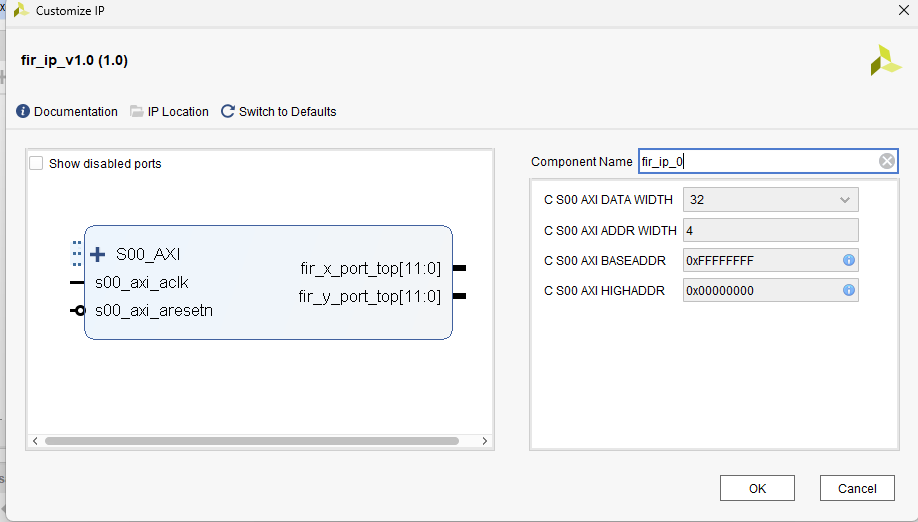
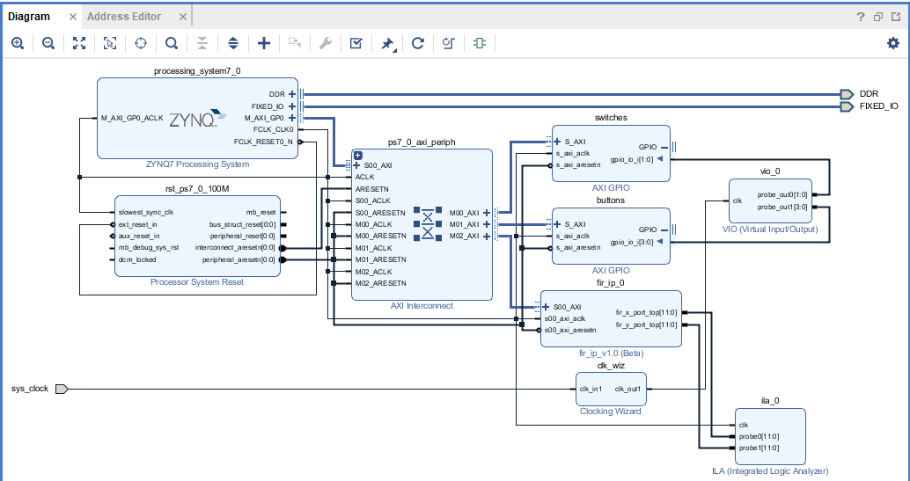
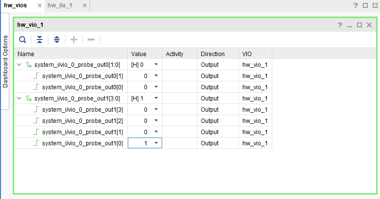
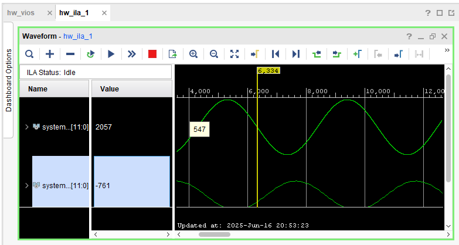
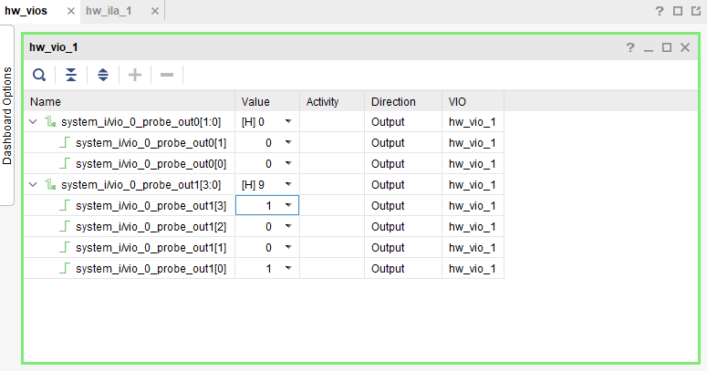
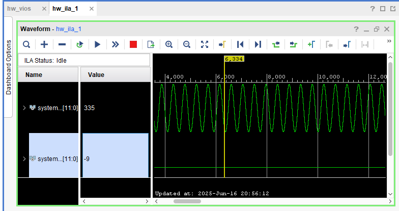
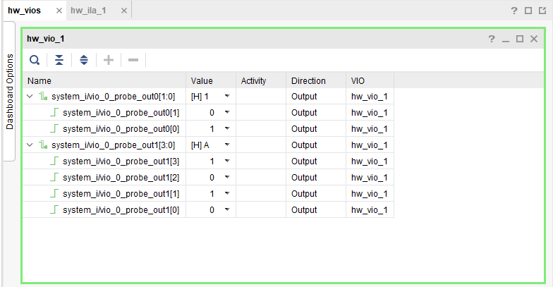
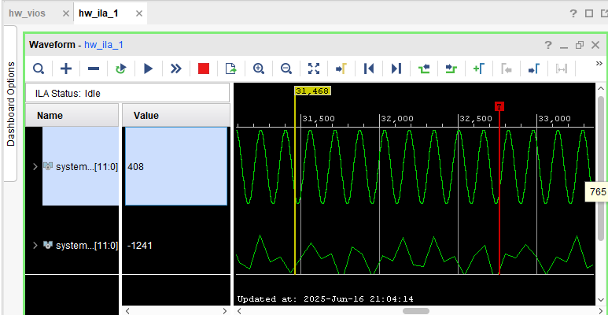

# FINAL_MYS

## Autor:
José Luis Krüger

## Enunciado general
El trabajo práctico final de la materia consiste en la implementación de un bloque de hardware digital que deberá ser descripto en lenguaje VHDL(IP Core), simuladoe implementado en un kit de FPGA Dicho bloque deberá formar parte de un sistema base de procesamiento que incluya el microCortex A9. Se deberá implementar la conectividad entre el PS y la PL. El core recibirá/enviará datos desde/hacia el procesador. Dicho funcionamiento deberá ser implementado a través de un código C. El bloque será el egido por el alumno y deberá ser alguna parte constitutiva de su trabajo práctico final de carrera. En el caso en que este último requerimiento sea de difícil concreción la cátedra indicará el bloque a implementar o se aceptarán sugerencias de parte del alumno. 
## Requerimientos detallados 
1. Bloque de hardware digital que implementa parte de alguna funcionalidad del trabajo final de carrera (consensuado con el docente). 
2. Lenguaje HDL a utilizar: VHDL/Verilog. 
3. Se pueden utilizar bloques escritos por terceros, pero esto tendrá impacto en la nota final 
4. Se deberán simular todos los componentes que formen parte del bloque principal (utilizando cualquier aplicación disponible, Vivado, ModelSim, GHDL+GTKWave, etc). 
5. Se deberá simular el bloque principal.  
6. Se deberá sintetizar e implementar el diseño y finalmente crear el archivo de configuración (.bit), utilizando cualquier aplicación disponible para tal fin, comopor ejemplo Vivado. 
7. Se deberá implementar una aplicación(códigoC) para lograr la transferencia de datos entre el micro y el core creado. 
8. Se deberá crear un documento que contenga: 
a. Una breve explicación de lo implementado 
b. Diagramas en bloques del circuito 
c. Capturas de las simulaciones realizadas más relevantes 
d. Tabla de uso de recursos de la FPGA 
9. Se deberá configurar la FPGA y validar el funcionamiento del bloque implementado.Este punto podrá no ser realizado, pero esto tendrá impacto en la nota final. 
10.La fecha de entrega es la correspondiente a la última clase de la materia,en la que deberán realizar una presentación de 10 minutos, explicando lo realizado y mostrando los resultados. 
## Entregables 
1. Documento en formato PDF, de acuerdo al requerimiento 8. 
2. Código VHDL/Verilogde todo lo implementado (no incluir archivos generados por las herramientas). 
3. Código C de la aplicación implementada. 
4. Presentación.


## Descripción de la implementación

Cómo trabajo final se decidió empaquetar un filtro FIR elimina banda (desarrollado como trabajo final de la materia CLP). Para lograrlo, se creó el archivo filter_pkg.vhd.
Dicho componente consta con 4 conexiones, dos de ellos contiene la entrada y salida del filtro interno, y las dos restantes son las correspondientes a CLK y el paso del NCO. Este ultimo parámetro es el que se configura por medio del bus AXI.


 ```vhdl
 entity filter_pkg is
	port(
		clk_top     : in  std_logic;
        fir_in_top  : out  unsigned(11 downto 0);
        PASO_W_top  : in unsigned (5 downto 0);
        y_out_top   : out unsigned(11 downto 0)
	);
end;
 ```
A continuación se presenta el IP core logrado:




El circuito completo cuenta, además, consta con las conexiones de dos switches y cuatro botones (utilizados para establecer el paso del NCO), un VIO (necesario para comandar los botones y los switches) y un ILA (necesario para visualizar las formas de onda):



Ya en el entorno SDK se desarrolló el código necesario para comandar, a traves del bus AXI, el paso de control del NCO:

```c
        psb_check = XGpio_DiscreteRead(&push, 1);
        dip_check = XGpio_DiscreteRead(&dip, 1);   // leo switches

        xil_printf("Botones: 0x%x | Switches (PASO NCO): 0x%x\r\n", psb_check, dip_check);

        unsigned int paso_w = (dip_check << 4) + psb_check;

        // Escribe el valor le�do al registro 0 del IP FIR (PASO_W)
        FIR_IP_mWriteReg(XPAR_FIR_IP_0_S00_AXI_BASEADDR, FIR_IP_S00_AXI_SLV_REG0_OFFSET, paso_w);

        sleep(1);
```
Una vez sintetizado el hardware y compilado el código, se realizaron las pruebas sobre el servidor remoto provisto por la catedra.

A continuación se presentan las distintas configuraciones realizadas realizadas:

### 1. Frecuencia baja:



### 2. Frecuencia media:



### 3. Frecuencia alta:



## Conclusiones

Se logró crear correctamente un IP core propio y comunicarlo con el microcontrolador embebido.

A lo ya visto en la materia CLP, se suma la posibilidad de interactuar por medio de código con cualquier elemento de hardware creado lo que amplifica enormemente el panorama de aplicación de esta tecnología


## Directorios

El código descrito en este documento se puede encontrar dentro del repositorio:

- Fuentes del filtro:
``
FIR/src
``
- Fuentes del proyecto en Vivado:
``
sintesis/TP_FINAL
``
- Fuentes del código C:
``
sintesis/TP_FINAL/TP_FINAL.sdk/trabajo_final_v1/src/fir_controller.c
``
- Presentación:
``
Implementación de filtro FIR.pdf
``
- Informe:
``
Implementación de un filtro FIR - MYS.pdf
``
- Evidencia gráfica:
``
capturas
``